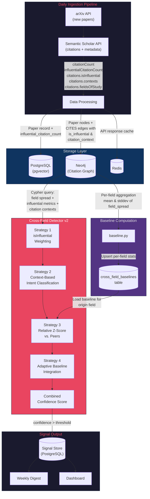
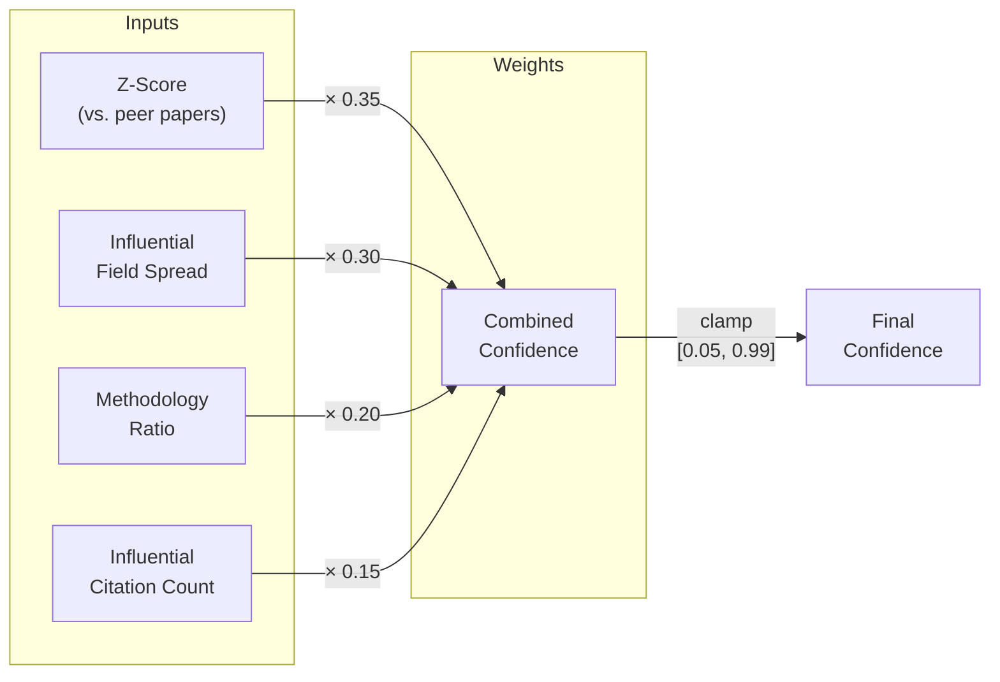

# Cross-Field Citation Inflation Hardening — Developer Reference
### Version 2.0 | June 2026 | Author: Vishnu N

---

## Background & Motivation

The cross-field citation anomaly detector is SignalZero's primary signal for identifying paradigm-shifting research — papers cited across multiple distinct fields indicate ideas that transcend their origin domain. However, AI-powered literature tools (Elicit, Consensus, Semantic Scholar recommendations) are **inflating cross-disciplinary citation rates across the board**, threatening to make this signal meaningless.

**The core problem:** If every paper gets cited across 3+ fields due to AI-assisted literature discovery, a static threshold like `field_spread >= 3` stops being a useful anomaly indicator.

**The solution:** Replace absolute thresholds with a multi-factor, self-calibrating scoring system that measures quality and relative rarity of cross-field citations.

---

## Architecture Overview

### Data Flow — Cross-Field Detection Pipeline v2



### Confidence Scoring Formula



```
confidence = min(0.99, max(0.05,
    (Z-score / 4.0)              × 0.35    # Relative rarity vs. peers
  + (influential_spread / 5.0)   × 0.30    # Influential field spread
  + methodology_ratio            × 0.20    # Intent quality
  + min(0.15, inf_count / 20.0)            # Influential citation count
))
```

---

## The Four Strategies — Detailed Reference

### Strategy 1: `isInfluential` Weighting

| Item | Detail |
|---|---|
| **Data Source** | Semantic Scholar `isInfluential` flag on citations |
| **Where Stored** | Neo4j CITES edge property `r.is_influential` |
| **How Used** | Cypher query collects `influential_citing_fields` separately from `all_citing_fields` |
| **Weight in Score** | 30% (influential field spread) |
| **Config** | `CROSS_FIELD_INFLUENTIAL_WEIGHT = 3.0` |

S2's `isInfluential` flag indicates citations where the citing paper relies substantially on the cited work (not just a passing mention). This is our best proxy for filtering AI-tool-generated shallow citations.

### Strategy 2: Context-Based Intent Classification

| Item | Detail |
|---|---|
| **Data Source** | S2 `contexts` field (text snippets around citations) |
| **Where Stored** | Neo4j CITES edge property `r.citation_context` |
| **Classifier** | Keyword heuristic in `classify_citation_intent()` |
| **Weight in Score** | 20% (methodology ratio) |
| **Config** | `CROSS_FIELD_METHODOLOGY_WEIGHT = 3.0`, `CROSS_FIELD_BACKGROUND_WEIGHT = 0.5` |

**Why not use S2's `intents` field?** We tested it live — it returns empty arrays for the vast majority of citations, even for massively cited papers like the Transformer and BERT. S2 has been deprioritizing their intent classifier. The `contexts` field has much better coverage.

**Pattern categories:**

```
METHODOLOGY (20 patterns):
  "we use", "we adopt", "we follow", "we employ", "we apply",
  "we extend", "we build on", "based on", "our model is based on",
  "we fine-tune", "we leverage", "inspired by", ...

BACKGROUND (14 patterns):
  "has been shown", "previous work", "related work", "prior study",
  "it is known that", "literature", "survey", "review of",
  "existing methods", "recent advances", ...
```

**Decision logic:** Count methodology hits vs. background hits. Higher count wins. Ties → `"unknown"` (treated as neutral 0.5 weight).

### Strategy 3: Relative Z-Score

| Item | Detail |
|---|---|
| **Data Source** | `CrossFieldBaseline` table (PostgreSQL) |
| **Function** | `compute_relative_zscore(field_spread, origin_field, db)` |
| **Formula** | `Z = (observed_spread - baseline_mean) / baseline_stddev` |
| **Weight in Score** | 35% (largest single factor) |
| **Config** | `CROSS_FIELD_ZSCORE_THRESHOLD = 2.0` |

**Fallback:** If no baseline exists for a field (new or rare field), uses conservative prior: `mean=1.5, stddev=1.0`.

**Why this matters:** If AI tools push the average field spread from 2.0 to 4.0 over time, the baseline auto-adjusts. A paper that was anomalous at spread=4 when the average was 2 will no longer be anomalous when the average is 4. Only papers significantly above the *current* norm trigger.

### Strategy 4: Adaptive Rolling Baselines

| Item | Detail |
|---|---|
| **Module** | `src/signalzero/core/detectors/baseline.py` |
| **Function** | `compute_cross_field_baselines(db)` |
| **Trigger** | Called automatically at the end of `ingest_daily_papers()` |
| **Storage** | `cross_field_baselines` table — one row per origin field |
| **Config** | `CROSS_FIELD_BASELINE_WINDOW_DAYS = 90` |

Computes per-field statistics via Cypher:
```cypher
MATCH (citing:Paper)-[:CITES]->(p:Paper)
WITH p, p.primary_field AS origin_field,
     count(DISTINCT citing.primary_field) AS field_spread
WITH origin_field,
     avg(field_spread) AS mean_spread,
     stDev(field_spread) AS std_spread,
     count(p) AS paper_count
WHERE paper_count >= 5
RETURN origin_field, mean_spread, std_spread, paper_count
```

---

## File Reference

```
src/signalzero/
├── core/
│   └── detectors/
│       ├── cross_field.py      # v2 detector — 4-strategy scoring
│       ├── baseline.py         # [NEW] Adaptive baseline computation
│       ├── convergent.py       # Convergent discovery detector
│       └── vocab_drift.py      # Vocabulary emergence detector
├── models/
│   └── models.py               # Paper.influential_citation_count + CrossFieldBaseline
├── services/
│   ├── database.py             # InMemoryNeo4j mock (v2 format)
│   └── ingestion.py            # S2 API expansion + Neo4j edge properties + baseline hook
└── utils/
    └── config.py               # 5 new tunable settings

tests/unit/
└── test_detectors.py           # 4 new tests (intent, z-score, ordering)
```

---

## Neo4j Schema Changes

### CITES Edge Properties (New in v2)

```cypher
-- Before (v1)
(citing:Paper)-[:CITES]->(cited:Paper)

-- After (v2)
(citing:Paper)-[r:CITES {
  is_influential: Boolean,      -- S2's influential citation flag
  citation_context: String      -- First context snippet (max 500 chars)
}]->(cited:Paper)
```

### Paper Node Properties (Unchanged)

```cypher
(:Paper {
  arxiv_id: String,
  title: String,
  published_date: String,
  primary_field: String          -- e.g. "cs.CL"
})
```

---

## PostgreSQL Schema Changes

### Papers Table (Modified)

```sql
ALTER TABLE papers ADD COLUMN influential_citation_count INTEGER DEFAULT 0;
```

### Cross-Field Baselines Table (New)

```sql
CREATE TABLE cross_field_baselines (
    id              INTEGER PRIMARY KEY,
    origin_field    VARCHAR(50) UNIQUE NOT NULL,  -- e.g. "cs.CL"
    avg_field_spread    FLOAT DEFAULT 1.0,
    stddev_field_spread FLOAT DEFAULT 0.5,
    paper_count         INTEGER DEFAULT 0,
    computed_at         TIMESTAMP
);
```

---

## Configuration Reference

All settings are in `src/signalzero/utils/config.py` and can be overridden via environment variables.

| Setting | Default | Description |
|---|---|---|
| `CROSS_FIELD_MIN_FIELDS` | 3 | Minimum field spread to consider (v1, retained) |
| `CROSS_FIELD_INFLUENTIAL_WEIGHT` | 3.0 | Multiplier for influential vs. non-influential citations |
| `CROSS_FIELD_METHODOLOGY_WEIGHT` | 3.0 | Weight for methodology-intent citations |
| `CROSS_FIELD_BACKGROUND_WEIGHT` | 0.5 | Weight for background-intent citations |
| `CROSS_FIELD_ZSCORE_THRESHOLD` | 2.0 | Minimum Z-score to flag as genuine anomaly |
| `CROSS_FIELD_BASELINE_WINDOW_DAYS` | 90 | Rolling window for baseline computation |

---

## Testing

```bash
# Run all detector tests
.venv/bin/python -m pytest tests/unit/test_detectors.py -v

# Run full suite
.venv/bin/python -m pytest tests/ -v
```

### Test Coverage

| Test | What It Validates |
|---|---|
| `test_cross_field_detector_mock` | End-to-end v2 detector with mock Neo4j returns correct structure |
| `test_citation_intent_classifier` | Keyword heuristic correctly classifies methodology/background/unknown |
| `test_relative_zscore_with_baseline` | Z-score math correct when baseline exists |
| `test_relative_zscore_without_baseline` | Fallback prior used when no baseline exists |
| `test_cross_field_confidence_ordering` | Transformer paper scores higher than Diffusion paper |

---

## Migration Notes

- **Fresh databases:** `Base.metadata.create_all()` handles everything automatically.
- **Existing PostgreSQL:** Run the `ALTER TABLE` and `CREATE TABLE` statements above.
- **Existing Neo4j:** Old CITES edges without `is_influential`/`citation_context` properties return `null`/`false` — the Cypher query handles this gracefully. No migration needed.
- **Redis:** No changes needed.
